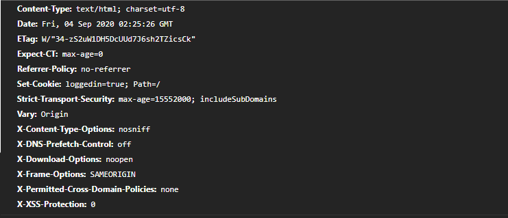

# Learning node server
  Learning Node with security
  
  
 
# CORS
Cross-origin resource sharing (CORS) allows AJAX requests to skip the Same-origin policy and access resources from remote hosts.

# Header X-Powered-By
This type of header is known as ServerTokens / ServerSignature, it reveals server information such as: name, version, technology and in some cases even the operating system.

# Use Helmet
Helmet can help protect your application from some well-known web vulnerabilities by configuring HTTP headers accordingly.

Helmet is actually just a collection of nine smaller middleware functions that configure security-related HTTP headers:
X-Content-Type-Options: nosniff
X-DNS-Prefetch-Control: off
X-Download-Options: noopen
X-Frame-Options: SAMEORIGIN
X-Permitted-Cross-Domain-Policies: none
X-XSS-Protection: 0

Make With Love - @boscobecker
